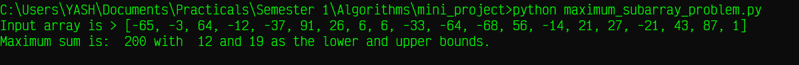
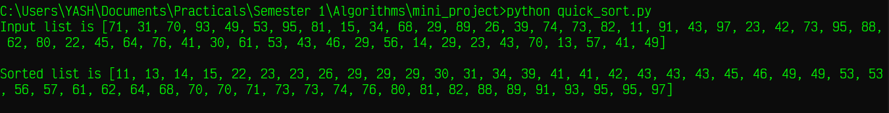

# 
 Algorithm Mini Project 

## 
 Implementation of the Maximum Subarray Problem and Quicksort in Python3 

----

#### Implementation details:

1. ***Build platform*** : [Python3 v3.9.8 (64 bit)](https://www.python.org/downloads/release/python-398/) on Windows 10 Home Edition.
2. ***Target platform*** : Any operating system capable of running Python3 v3.6+.
3. ***File format*** : Python Source Files (.py)
4. ***System packages used*** : [`random`](https://docs.python.org/3.9/library/random.html)
5. ***Additional packages used*** : None

### 
Maximum Subarray Problem 

> In [computer science](https://en.wikipedia.org/wiki/Computer_science), the **maximum sum subarray problem** is the task of finding a contiguous subarray with the largest sum, within a given one-dimensional [array](https://en.wikipedia.org/wiki/Array_data_structure) A[1...n] of numbers. Each number in the input array A could be positive, negative, or zero.
>
> For example, for the array of values [−2, 1, −3, 4, −1, 2, 1, −5, 4], the contiguous subarray with the largest sum is [4, −1, 2, 1], with sum 6.
>
> Some properties of this problem are: 
>
> 1. If the array contains all non-negative numbers, then the problem is trivial; a maximum subarray is the entire array.
>
> 2. If the array contains all non-positive numbers, then a solution is  any subarray of size 1 containing the maximal value of the array (or the empty subarray, if it is permitted).
>
> 3. Several different sub-arrays may have the same maximum sum. \- [Wikipedia](https://en.wikipedia.org/wiki/Maximum_subarray_problem)

- Source file : [maximum_subarray_problem.py](maximum_subarray_problem.py)
- Output screenshot file: [maximum_subarray_problem.png](screenshots/maximum_subarray_problem.png)
- Output screenshot: 

### 
Quicksort 

> **Quicksort** is an [in-place](https://en.wikipedia.org/wiki/In-place_algorithm) [sorting algorithm](https://en.wikipedia.org/wiki/Sorting_algorithm). Developed by British computer scientist [Tony Hoare](https://en.wikipedia.org/wiki/Tony_Hoare) in 1959 and published in 1961, it is still a commonly used algorithm for sorting. 
>
> Quicksort is a [divide-and-conquer algorithm](https://en.wikipedia.org/wiki/Divide-and-conquer_algorithm). It works by selecting a 'pivot' element from the array and partitioning the other elements into two sub-arrays, according to whether they are  less than or greater than the pivot. For this reason, it is sometimes  called **partition-exchange sort**. The sub-arrays are then sorted [recursively](https://en.wikipedia.org/wiki/Recursion_(computer_science)). This can be done [in-place](https://en.wikipedia.org/wiki/In-place_algorithm), requiring small additional amounts of [memory](https://en.wikipedia.org/wiki/Main_memory) to perform the sorting.
>
> Quicksort is a [comparison sort](https://en.wikipedia.org/wiki/Comparison_sort), meaning that it can sort items of any type for which a "less-than" relation (formally, a [total order](https://en.wikipedia.org/wiki/Total_order)) is defined. Efficient implementations of Quicksort are not a [stable sort](https://en.wikipedia.org/wiki/Sorting_algorithm#Stability), meaning that the relative order of equal sort items is not preserved.
>
> [Mathematical analysis](https://en.wikipedia.org/wiki/Analysis_of_algorithms) of quicksort shows that, [on average](https://en.wikipedia.org/wiki/Best,_worst_and_average_case), the algorithm takes *O*(*n* log *n*) comparisons to sort *n* items. In the worst case, it makes *O*(*n*2) comparisons. \- [Wikipedia](https://en.wikipedia.org/wiki/Quicksort)

- Source file : [quick_sort.py](quick_sort.py)
- Output screenshot file: [screenshots/quick_sort.png](screenshots/quick_sort.png)
- Output screenshot: 

