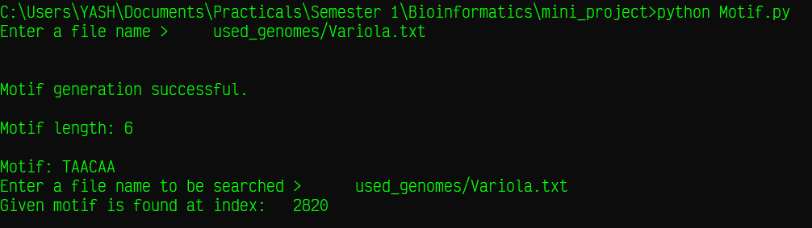

# 
 Bioinformatics Mini Project 

## 
 Motif implementation in Python3 

----

#### Implementation details:

1. ***Build platform*** : [Python3 v3.9.8 (64 bit)](https://www.python.org/downloads/release/python-398/) on Windows 10 Home Edition.
2. ***Target platform*** : Any operating system capable of running Python3 v3.6+.
3. ***File format*** : Python Source Files (.py)
4. ***System packages used*** : [`random`](https://docs.python.org/3.9/library/random.html)
5. ***Additional packages used*** : None

#### File description

1. ***File name***: [Motif.py](Motif.py)

2. ***Genome used***: [Variola.txt](used_genomes/Variola.txt) [More information...](https://en.wikipedia.org/wiki/Smallpox)

3. ***Output Screenshot***:[Motif.png](screenshots/Motif.png)

   

## 
 Concepts 

### 
 Biological Motif 

> A biological motif, broadly speaking, is a pattern found occurring in a  set of biological sequences, such as in DNA or protein sequences. A  motif could be an exact sequence, such as TGACGTCA, or it could be a degenerate consensus sequence, allowing for ambiguous characters, such as R for A or G. Motifs can also be described by a probabilistic model, such as a position-specific scoring matrix (PSSM) or weight matrix. \- [Oregon State University](https://open.oregonstate.education/appliedbioinformatics/chapter/chapter-2-sequence-motifs/)
